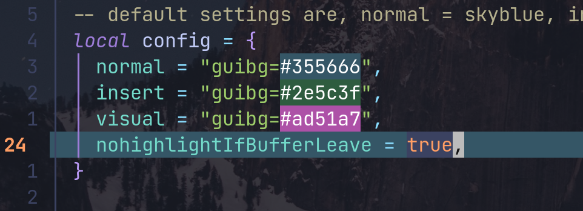
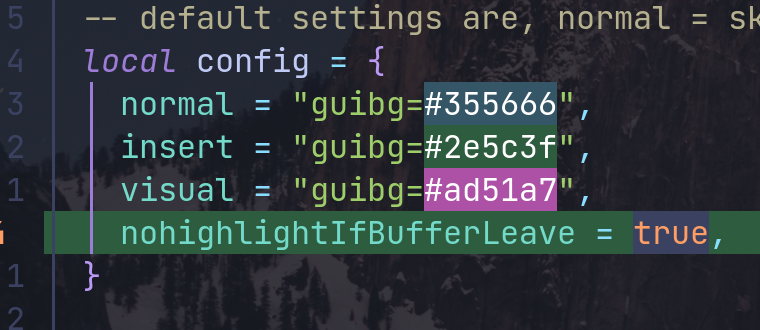
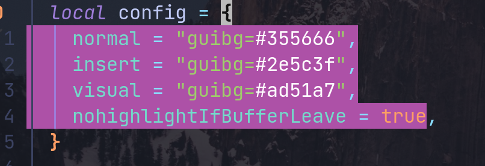

# Cursor line Highlighter

## highlight your "Cursor line" by current mode

Change Line's color by current mode. And if you set true to hide highlight when
you leave current buffer, remove them

Using Example

Normal Mode

Insert Mode

Visual


If you using packer to manage plugins, the below is config example

```lua

use({
  "ds1sqe/cusorlineHighlighter.nvim",
  event = "BufReadPost",
  config = function()
    require("cusorHl").setup({
      local config = {
      normal = "guibg=#355666", -- cusorline color of normal mode
      insert = "guibg=#2e5c3f", --               "" of insert mode
      visual = "guibg=#ad51a7", -- selected line's color of visual mode
      nohighlightIfBufferLeave = true, -- hide highlight if leave current buffer
	}
      })
  end,
})


```
